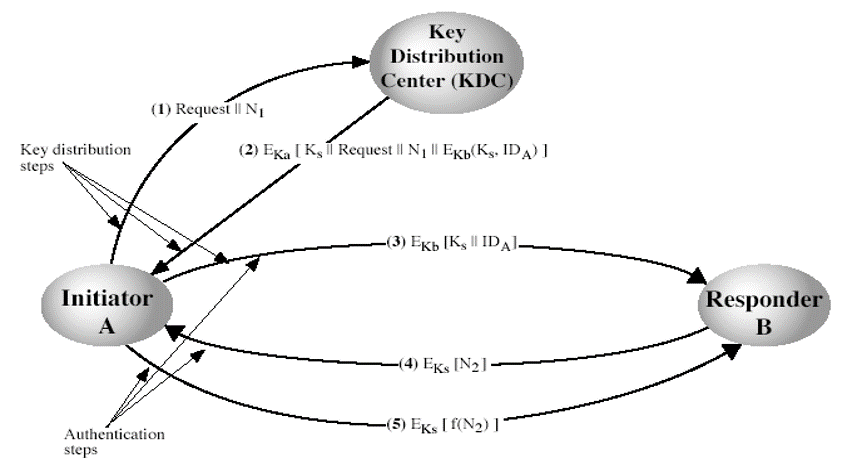
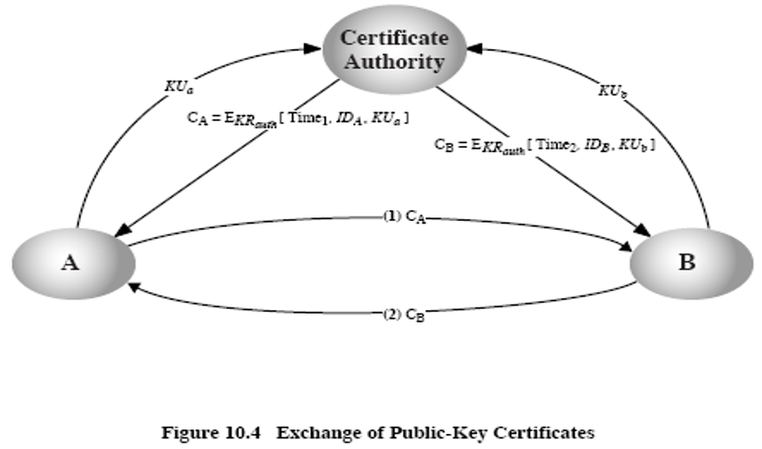

# 信息安全概述

## 信息安全的基本属性与密码学的关系
信息安全的五种基本属性

- 保密性    
信息不能泄露给非授权的个人、实体或供其利用的机会。    
加密是密码学的一个基本功能。

- 完整性    
信息在存储或传输的过程中保持不被修改、破坏、插入等。    
可以通过完整性算法或Hash算法完成，这也是密码学具有的一个基本功能。

- 可用性    
信息和相关资源持续有效，而且合法用户可以访问和使用信息。即当需要信息时能够保证取用。    
在密码学中，只要持有密钥的合法用户都可以使用信息。

- 可认证性    
可识别、可验证。识别是 辨认是谁，验证是 证明是谁。    
在密码学中，可以采用公钥密码体制来实现，私钥代表了用户的身份。

- 抗抵赖性    
防止否认自己进行过的信息活动。    
通常采用公钥密码体制的数字签名方法来实现。

## 常用密码手段
确保信息的安全存储、传输和使用，可以使用四种基本手段，即加密、鉴别、完整性检验和安全管理。

### 加密技术
加密是按照某种确定的加密变换方法(加密算法)，对未经加密的信息(明文)进行处理，使其成为难以读懂的信息(密文)。    
解密是根据密文把原始信息恢复出来。    

加密变换的保密性取决于密钥的保密，而不是取决于对算法的保密。这是设计密码体制时的一个重要原则。

密码体制
- 对称密码体制    
加密和解密时使用相同密钥。    
DES AES

- 非对称密码体制 公开密钥体制(公钥体制)    
加密和解密时使用不同的密钥。只需对一个密钥保密，而把另一个密钥公开。    
RSA ECC    
RSA 的保密强度来自于大合数的分解的困难性，ECC的保密强度来自求椭圆曲线有限域上的离散对数。

一般来说，公钥体制要求的密钥比对称密码体制的密钥更长。因此，虽然公钥密码体制避免了密钥分配方面的诸多麻烦，易于进行密钥管理，但其计算量较大，加密速度较慢，故多用于专用场合。

通信系统中传输的信息有链路加密和端到端加密两种加密方式。

从实现加密的手段来看，目前有硬件加密和软件加密两大类。

### 消息鉴别
鉴别的基本任务是防止非法用户闯入信息系统，防止接收来自不明身份的通信信息以及防止通信双方发生抵赖。

- 消息源鉴别    
接收到的消息来自确定的发送方，防止第三者欺骗。    
通常在消息的头或尾部加上一个鉴别码。鉴别码必须满足两个条件：接收者必须能验明该鉴别码只能由发送方产生、鉴别码必须和发送的消息密切相关。    
产生鉴别码的算法称作鉴别算法，一般用密码学上的Hash函数或专用鉴别算法来完成。

- 抗抵赖    
一项交易的一方在事后不能否认其参与了该项交易。在通信系统中可以用数字签名来解决，数字签名是公钥密码体制使用的主要方式这一。

- 数字签名    
防止别人伪造或签名者抵赖。    
数字签名算法要求具有以下特性
    - 除签名者外，任何人不能计算出该签名信息。签名信息必须与被签消息有密切关系。
    - 接收到消息和数字签名的任何人均可验证该签名消息的真实性，因而确定消息的来源和完整性。
数字签名的目的是使接收方能够验证发送者的签名，但不能伪造；发送者把签了名的消息发送给接收者后，便不能否认其签名的消息。

### 完整性校验
数据完整性是信息安全性的重要内容，在大多数信息系统，完整是最重要的安全要求，受到人们广泛重视。    
完整性保护机制主要对传输过程中的信息，防止他人非法产生、删除和修改。    
完整性校验采用密码校验和数字签名以及各种完整性检验算法。

### 安全管理
使保护对象的安全性达到可接受的合适水平的一个完整的管理过程。

## 密码学基本术语
- 明文 m    
可以理解其含义的文字或编码序列称为明文。

- 密码本    
大量的、预先编制好的数字组合或文字组合放在一起组成了密码本。

- 密文 c    
对明文进行加密后的信息称为密文。

- 密表    
把明文变换成密文形式的对应的表。基本变换方法有代替法和换位法。

- 密钥 k    
在密码变换中用于控制密码变换的可变在关键变量。在加密变换中使用的密钥称为加密密钥，在解密变换中使用的密钥称为解密密钥。

- 密码体制    
+------+ 明文m +--------+        +--------+ 明文m
|消息源+-----> |加密变换+------> |解密变换+-------->
+------+       +--------+ 密文c  +--------+
                    ^                 ^
              密钥k1|           密钥k2|
                    +-----------------+
                    |
               +----+---+
               |密钥源  |
               +--------+
- 加密    
通过加密密钥和加密算法把明文信息变成密文信息的过程

- 解密    
通过解密密钥和解密算法把密文信息变成明文信息的过程

- 密码分析    
虽然没有掌握正确的密钥和密码体制，也企图破译通过各种门路获得的密文。
有六种类型
    - 唯密文攻击
    - 已知明文攻击 攻击者得到一段密文并且知道相应明文，希望恢复密钥
    - 可能明文攻击 某些明文可能与密文相关
    - 选择明文攻击 不仅可以获得密文，而且能在某种程序上控制明文，来恢复密钥
    - 选择密文攻击 选择明文攻击的扩展，选择密文并用密钥来解密
    - 穷举攻击及变形方式 空间折中攻击、中间相遇攻击、彩虹表攻击、滑动攻击等

- 密码算法    
加密算法E 和 解密算法D 的统称    
密码算法可以看成一些变换的组合。加密算法和解密算法互为逆算法。

- 密码算法(体制)的设计准则    
在密码学发展史上，克尔克霍夫斯 于10世纪对军事密码体制提出的六项原则
    - 密码体制即便不是在理论上不可破的，也应该在实际上是不可破的
    - 体制的泄露不应该给通信者带来麻烦
    - 密钥应该便于记忆，而且容易更换
    - 密文应可用电报发送
    - 器械或文件应该可由一人携带和操作
    - 体制应该简易明了，即不需要懂冗长的规则，又不要使人精神紧张
六项原则之间存在一些矛盾，没有一个体制能同时符合这六项原则。    
前两项是现代密码编码学的基本原则    

在《保密体制的通信理论》一书中，香农提出评价保密体制的五项准则
    - 保密量 敌人无法破译一个完全保密体制
    - 密钥大小
    - 加解密操作的复杂度
    - 错误的扩散 解密时错误扩散应该尽可能小，以避免信息损失过大
    - 消息的扩展 经加密处理后，不希望消息的规模增大

一般来说，现代密码体制属于计算上保密

- 密码算法(体制)的强度测试
    - 序列密码
    - 分组密码
    - 公钥密码

# 古典密码学

## 简单密码体制介绍 
密码体制五元组(P,C,K,E,D)需满足以下条件
- P 所有可能明文的有限集合
- C 所有可能密文的有限集合
- K 所有可能密钥的有限集合
- 对任一 k ∈ K，都存在一个加密规则 ek ∈ E 和对应解密规则 dk ∈ D， 对每一个 ek:P->C 和 dk:C->P 对任意的明文 x ∈ P 满足 dk(ek(x)) = x

### 移位密码
最早使用的例子凯撒密码    
移位密码描述    
设 P=C=K=Z26。对0 <= k <= 15，任意的x,y ∈ Z26，定义    
加密算法: ek(x) = x + k mod 26    
解密算法: dk(x) = x - k mod 26

### 仿射密码
通过模26加法产生的是移位密码，通过模26乘法产生的密码称为 乘法密码。    
乘法密码描述    
对 k ∈ {1, 3, 5, 7, 9, 11, 15, 17, 19, 21, 23, 25}    
加密算法: ek(x) = k * x mod 26    

在乘法密码的结果上，再进行一个加法操作，就会得到新的密码，称为仿射密码。
对 k1 ∈ {1, 3, 5, 7, 9, 11, 15, 17, 19, 21, 23, 25}, k2 (- Z26    
加密算法: ek1k2(x) = k1 * x + k2 mod 26      

*互素*    
两个整数 a >= 1, b >= 2， 满足 gcd(a, m) = 1

*欧拉函数 φ(m)*    
定义在正整数集上的函数，φ(m)的值等于序列{1, 2, 3 ... m-1}中与m互素的数的个数 。

设  其中pi是不同的素数    
那么 =\prod_{i=1}^{n}(p_{i}^{e_i}-p_{i}^{e_{i}-1}))    
例如 26 = 2 * 13 则 φ(26) = (2^1 - 2^0) * (13^1 - 13^0) = 12

*同余式*    
ax ≡ b mod m 对每个 b ∈ Zm 有唯一解 x ∈ Zm 当且仅当 gcd(a, m) = 1    
所以 a 有模 m 的乘法逆元当且仅当 gcd(a, m) = 1,而且它必定是唯一的。

所以仿射密码体制的数学描述如下    
设 P=C=Z26, K={(a, b) ∈ Z26 * Z26| gcd(a, 26) = 1}    
对 k = (a, b) ∈ K, x ∈ P, y ∈ C    
加密算法: ek(x) = ax + b mod 26    
解密算法: dk(y) = a- (y - b) mod 26

### 维吉尼亚密码
以上介绍的移位密码和仿射密码中，一旦选定密钥，第一个明文字母所对应的密文字母都是唯一的。因此这此密码体制称为童瑶密码体制。    
维吉尼亚密码是一种分组密码    
描述    
设 m 是一个整整数。定义 P=C=K=(Z26)^m, 对于一个密钥 k = (k1, k2,, k3....km)    
加密算法: ek(x) = (x1+k1, x2+k2, ..., xm + km) mod 26
解密算法: dk(y) = (y1-k1, y2-k2, ..., ym - km) mod 26

## 密码分析
密码分析学的主要目的是研究加密消息的破译和消息的伪造    
根据密码分析者破译时已具备的前提条件，通常密码攻击分为四种
- 唯密文攻击 
- 已知明文攻击 
- 选择明文攻击
- 选择密文攻击
上述四种攻击的目的是确定正在使用的密钥。攻击强度是顺序增加的，如果一个密码体制能够抵抗选择密文攻击，则能抵抗前三种攻击。

密码分析的许多特性是利用了英文语言的统计特性。

# 数论

## 欧几里得算法

欧几里得除法1    
设整数 a、b, 其中 b > 0 , 存在唯一整数q、r使得     
a = bq + r, 0 <= r < b

欧几里得除法2    
设整数 a、b, 其中 b > 0 , 对任意整数 c, 存在唯一整数q、r使得     
a = bq + r, c <= r < b + c    
- 0 <= r < b 时叫最小非负余数
- 1 <= r <= b 时叫最小正数余数
- -b + 1 <=r <= r 时叫最大非正余数
- -b <= r < 0 时叫最大负余数
- -b/2 <= r < b/2 时叫绝对值最小余数

*定理*    
设 a、b、c 为三个不全为0的整数，如果 a = bq + c，其中q是整数，则 gcd(a, b) = gcd(b, c)

## 扩展欧几里得算法
sa + tb = gcd(a, b)

*定理*    
设a, b是正整数，r0 = a, r1 = b, rn = gcd(a, d), 则sn a + tn b = gcd(a, b)    
s0 = 1, s1 = 0, sj = s(j-2) - q(j-1) s(j-1)    
t0 = 0, t1 = 1, tj = t(j-2) - q(j-1) t(j-1)

## 模运算性质
- 如果 n|(a-b), 那么 a ≡ b mod n
- 如果 a ≡ b mod n, b ≡ c mod n 那么 a ≡ c mod n
- [a mod n + b mod n ] mod n = (a + b) mod n
- [a mod n - b mod n ] mod n = (a - b) mod n
- [a mod n * b mod n ] mod n = (a * b) mod n
- 如果 a + b ≡ a + c mod n，那么 b ≡ c mod n
- 如果 a, b 互素，且 a * b ≡ a * c mod n，则 b ≡ c mod n

## 离散对数
*欧拉定理*    
如果 gcd(a, n) = 1, 则 a ^ φ(n) ≡ 1 mod n

*定义 模n下a的阶*    
a ^ m ≡ 1 mod n 的最小正正数 m 称为 模n下a的阶    
*定义 素根*    
如果 a 的阶等于 φ(n) ,则称 a 为 n 的素根    
*定理*    
如果 a 是 n 的素根， 则 a, a^2, a^3,...a^φ(n) 在模 n 下互不相同，且互素    
特别地，如果 a 是素数 p 的素根，则 a, a^2, a^3,...a^(p-1) 在模 p 下，均与p互素

设 p 是素数，a 是 p 的素根，则    
对于任意 y(1<= y <= p-1) 都存在唯一的正整数 x(1<= x <= p-1) 使得
y ≡ a^x mod p    
称 x 为模 p 下以 a 为底 y 的对数。记为 x = ind a,p (y)  即离散对数

离散对数性质
- ind a,p (1) = p-1
- ind a,p (a) = 1
- ind a,p (xy) = [ind a,p (x) + ind a,p (y)] mod φ(p)
- ind a,p (x^y) = [y * ind a,p (x)] mod φ(p)
- 若 a^x ≡ a^y mod n, 其中a,n互素, a是n的素根, 则有 x ≡ y mod φ(n)

当a,p和x已知求y时至多需要2log a p 次乘法运算    
当a,p和y已知求x时至少需要 p^0.5 次以上运算。离散对数问题

## 素数测试

### 费马定理
若 p 是素数，a 是正整数且不能被 p 整除 则 a^(p-1) ≡ 1 mod p

### 费马素性测试
若给定数 n，能找个一个整数 a 使得 a^(n-1) !≡ 1 mod n，则 n 是一个合数

### 欧拉定理
如果 gcd(a, m) = 1，则有 a^φ(m) ≡ 1 mod m

### Miller-Rabin 素数测试

# 分组密码
分组密码将明文消息刬分成长度为 m 的分组，各组分别在密钥的控制下加密成等长(长度n)的密文。
通常情况下 m = n，即无数据扩展和压缩。    

## 分组密码基本结构 
流行的分组密码均是迭代型，即基于一个简单函数F迭代若干次形成。每次迭代称为一轮，相应的函数F称为轮函数。
迭代型分组密码一般由加密算法、解密算法和密钥编制算法三部分组成。密钥编制算法是将短的用户密钥扩展成若干个子密钥，再将这些子密钥作为每一轮的加密密钥参与轮运算。
目前普遍采用的加密算法结构有 Feistel结构及其变体、SPN结构、IDEA结构、MISTY结构。

### Feistel 结构 
DES算法使用
轮运算过程    
R(i+1) = Li    
L(i+1) = F(Li, ki)⊕ Ri   
Feistel结构的加密解密算法结构相同

### SPN 结构 
AES算法使用    
轮运算过程    
输入 -> S层 -> P层 -> 输出     
S层替换，一般称为混淆层；P转换，一般称为扩散层。    
SPN与Feistel相比，可以得到更快速的扩散，适宜高速硬件实现。

## 分组密码工作模式
分组密码处理消息的长度是固定的，但是在实际 中需要处理的消息通常是任意长的，而分组密码本身做不到。
因此，引出如何利用分组密码处理任意长度消息的问题，解决这个问题的技术就是分组密码工作模式。
按照安全功能，分组密码工作模式可以分为加密模式，认证模式，认证加密模式和杂凑模式。

### 加密模式
- ECB Electronic Code Book
- CBC Cipher Block Chaining
- CFB Cipher Feedback
- OFB Output Feedback
- CTR Counter Mode

# 公钥密码
一个密码体制可以用一个5元组{M, C, K, E, D}来表示，公钥密码体制应当满足以下条件
- 对于任意的消息 m ∈ M, (K_e, K_d) ∈ K， 应当满足 D(E(m, K_e), K_d) = m
- 对于密钥对(K_e, K_m) ∈　Ｋ， 不能在计算上从Ｋ＿ｅ推导出K_d
- E和D都是多项式时间内可计算的函数

从本质上看，以上就是要求一个单向陷门函数(Trapdoor One-way Function)。
单向函数f是两个集合X, Y之间的一个映射，使得Y中的第一个元素y都有唯一的原像x∈X，且由x易于计算y，而由y计算x是不可行的。
若给定某些辅助信息使得由y计算x也是容易的，那么这就是一个单向陷门函数。这些给定的信息称为陷门。
把单向陷门函数的辅助信息作为解密解密，就是公钥密码体制的设计原理。

公钥密码体制包括加密、数字签名和密钥交换协议等。

## RSA
基于大数因式分解困难性问题的公钥密码体制。
RSA加密体制由密钥生成、加密、解密三个算法组成。

### 密钥生成
- 选择两个不同的大素数  p 和 p 
- 计算 n = p*q 和 φ(n) = (p-1) * (q-1)
- 随机选择整数 e 使得 1 < e < φ(n) 且 gcd(e, φ(n)) =1
- 计算满足  e * d ≡ 1 mod φ(n) 的整数 d， 1 < d < φ(n)。
(n, e)公开作为加密密钥， (n, d)保密作为解密密钥。将p q φ(n) 安全的丢弃。

### 加密
c = m^e mod n

### 解密
m = c^d mod n

# Hash 算法

## Hash 算法
由于其压缩特性，常用做消息的核实和认证。Hash函数又称为散列函数，其功能是将一串任意长度的消息映射为一个较短的固定长度的输出串。
Hash函数通常用来构造数据的数字指纹，以验证传输数据的完整性。

Hash函数的性质
- 输入消息的长度没有限制
- 压缩性 hash函数作用于长度的消息后得到固定长度的输出
- 正向计算简单 对任意给定的消息 m， 计算 y = H(m)比较容易
- 雪崩性 对任意给定的消息m，消息摘要y=H(m)与m的每一比特信息高度相关，只要改变消息m的任意1bit或多bit，输出都会发生显著变化 
- 单向性 对于任意给定的y=H(m)，找到满足的消息m是困难的
- 弱碰撞性 对于给定的消息m，找到另一个不同的消息m1，使得H(m) = H(m1)在计算是不可行
- 强碰撞性 找到任何满足 H(m1) = H(m2) 的二元组在计算上不可行

Hash函数用途
- 数字签名
- 口令管理
- 消息鉴别码

常用Hash函数
- MD 系列
- SHA 系列

## MAC 消息认证码
与密钥相关的单向散列函数通常称为HMAC。MAC具有单向散列函数的特性，但MAC还包括一个密钥。只有相同拥有密钥的人才能生成和鉴别这个散列值。

# 密钥管理
 密钥管理是处理密钥自生成到最终销毁的整个过程的所有问题，包括系统的初始化，密钥的产生、存储、备份/装入、分发、保护、更新、控制、丢失、吊销和销毁等。
 其中分发和存储是最大的问题。

## 密钥管理技术

密钥类型
- 初始密钥 由用户选定或系统分发的，在较长时间内被一个用户专用的秘密密钥
- 会话密钥 两个通信终端用户在一次会话或交换数据时所用的密钥。通常由系统通过密钥交换协议动态生成
- 密钥加密密钥 用于加密传输或存储其他密钥的加密密钥
- 主密钥 对密钥加密密钥进行加密的密钥，或是派生其他密钥的根密钥。它是最高级别的密钥，本身不受密码学的保护。

密钥生成 伪随机数 PRG

## 密钥分发
可靠地向合法请求的用户提供密钥，将密钥安全地传送到合法用户的密码装置中。
密钥分发的基本要求：
- 区分用户和密钥的层次，控制密钥的分发数量和范围
- 保证密钥分发过程中的绝对安全
- 按时按需供应，以保证密码通信不间断
- 方法简单易行，尽量自动分发

### 对称加密体制的密钥分发
两个用户在用对称加密体制进行保密通信时，首先必须有一个共享的秘密密钥，而且为防止攻击者得到密钥还必须经常更新密钥。
获得共享密钥的方法
- 密钥由A选取并通过物理手段发送给B
- 密钥由第三方选取并通过物理手段发送给A和B
- 如果A、B事先已有一个密钥，则其中一方选取新密钥后，用已有密钥加密密钥并发送给另一方
- 如果A、B事先与第三方C分别有一个保密信道，则C为A、B选取密钥后，分别在两个保密信道上发送给AB

第四种比较常用，其中的第三方通常是一个负责为用户分发密钥的密钥分发中心 KDC。这时每一个用户必须和KDC有一个共享密钥，称为主密钥。
通过主密钥分发给一对用户的密钥称为会话密钥，用于这一对用户之间的保密通信。    

### 公钥加密体制的密钥分发
PKI (Public Key Infrastructure)公钥基础设施。
公钥证书的申请、签发和使用需要的一套基础设施，包括证书签发和管理机构，提供证书服务的各种软硬软件以及相应的法律法规。
PKI 中的证书签发管理机构主要是注册机构 RA 和认证机构 CA 。
RA 负责受理用户证书申请的审核，根据用户的注册信息的合法性批准或拒绝证书申请。
CA 主要功能 产生证书 管理证书 撤销证书

为了防止任何人伪造公钥，可以通过认证机构 CA 来达到此目的。认证机构将用户的公钥、身份等信息打包、签名然后发布相应的证书。CA有一个众所周知的公钥，而且不能伪造。
CA核对用户的身份，然后询问用户的公钥，并将其写在相应的证书上。为了防止伪造证书，CA使用自身的私钥对证书签名。
如果其他用户想知道公钥，可以在CA处下载签署的证书，并使用CA的公钥提取到用户的公钥。

## Diffie-Hellman 协议
通过不安全的信道达成一个共享的密钥。
- A、B选择一个大的素数p和一个本元根a, a p 可以公开
- A、B分别秘密地选择一个随机整数x和y，其中1<=x,y<=p-2
- A计算出 m = a^x mod p 发送给B，B计算出 n = a^y mod p 发送给A
- 用收到的信息，双方各自计算出共享密钥K。A计算 K = n^x mod p 。B计算 K = m^y mod p。
易受中间人攻击。

##
密码体制的安全性都基于密钥。但在密码系统的实际应用中，密钥泄露很可能发生。
直接的方法是设置权限的专用硬件里进行有关密钥的操作。
密码学上防止密钥泄露的方法主要有秘密分享和门限密码，降低密钥泄露后的危害。

秘密分享是将密钥分享给多个持有者，每个持有者拥有密钥的一个份额 子密钥，只有多于特定数量的份额才能重构出密钥。
弱点在于重构密钥的持有者是安全的瓶颈。

门限密码解决了密钥重构时可能暴露的问题，虽然采用了秘密分享的思想，但是在密钥或签名中不需要首先恢复密钥，
而是直接由每个子密钥的持有者生成一个解密或签名碎片，再由特定数目的碎片得到最终的解密消息或签名。
